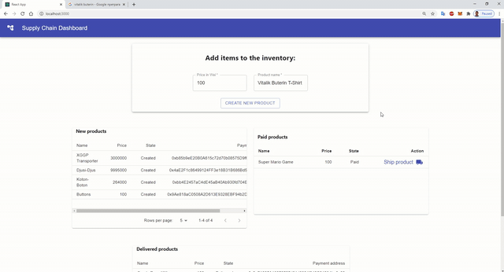

# Supply chain Dapp on Ethereum

## Introduction
This repository contains a Dapp as a demo concept on how you can automate and manage payments and the full life cycle of products, in a transparent way, on a Ehtereum blockchain, using smart contracts.

Using such system would give users `visibility`, `transparency` and `confidence` at every step.

`Supply chain workflow` (high level example):
1. Seller (owner of smart contract) creates new product.
2. New product is stored on blockchain with all necessary details and with uniqe address for payment (address of a new contract that has been created for handling the payment of that product).
3. Seller informs the customer who wants to purchase the item  with a price and address to make the payment.
4. The sustomer is making a payment, transferring the funds to required address.
5. Payment is automatically detected by listening to the events on a smart contract.
6. Once the payment is completed and detected, now the seler can update the status of product, to notify the warehouse to ship the product to the customer.

Described Dapp is implemented with [ReactJS](https://reactjs.org/), with [Material-UI](https://material-ui.com/) on top. For working with ethereum blockchain, [Truffle](https://www.trufflesuite.com/truffle) was used with [React Truffle Box](https://www.trufflesuite.com/boxes/react) boilerplate and [MetaMask](https://metamask.io/) for interacting with Dapp. [Ownable](https://github.com/OpenZeppelin/openzeppelin-contracts/blob/master/contracts/access/Ownable.sol) smart contract was used from [OppenZeppelin](https://openzeppelin.com/contracts/).

## Dapp demo
Here is the aplication showing full life cycle of one product managed by smart contracts: from crating a new product, making and handling the payment and shipping the new product once the payment is completed.

You can view that by following the status and movement of a product from one table to another after each step:

## Project structure
In this repository you may find:
- `truffle-config.js` file - contains solidity compiler version and the port number for local development blockchain.
- `contracts` directory - contains smart contracts for Dapp: `ProductManager.sol` and `ProductPaymenthandler.sol`
- `migrations` directory - contains migration files for smart contracts.
- `client` directory - contains ReactJS app.
 
## How to run code?

NodeJS version: `v10.15.0`.  
Solidity compiler version: `v0.6.6`.  
Truffle: `v5.1.40`.

Setting up and running the application :
- Install truffle:  `npm install truffle -g`
- Install npd moduls: `cd client` & `npm install`
- Start truffle developmnet blockchain: `truffle development`
- Compile and migrate smart contracts to the local blockchain (from truffle console): `migrate`
- Start react app: `cd client` & `npm start`

